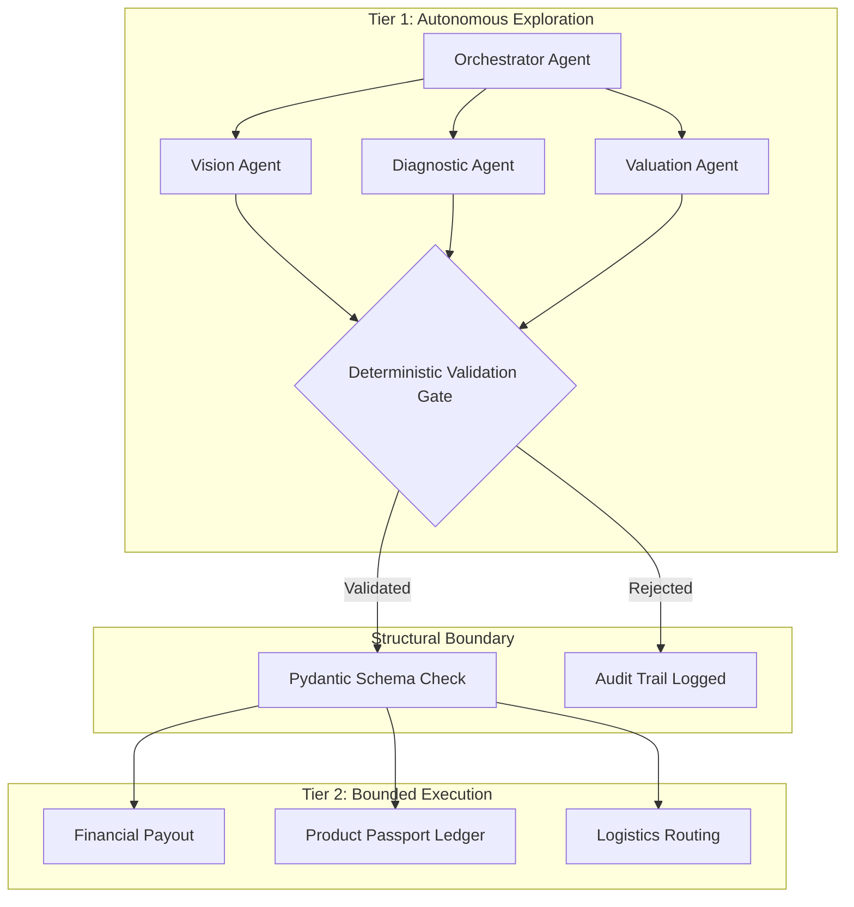
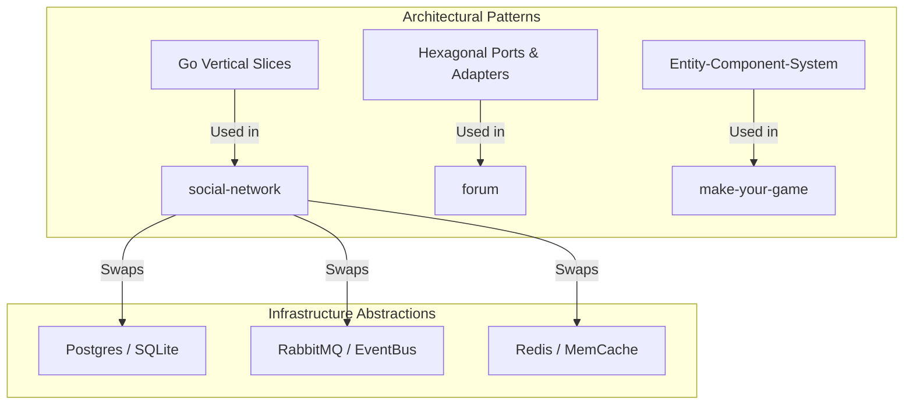

# GitHub Optimization Analysis & Action Guide — Ertval Karameta

**Context:** Post-CEO interview (Fanis Koutouvelis, successful ✓) → CTO/Architect interview (Nikos Tzamos / Anestis Kivranoglou)
**Date:** July 1, 2026
**Sources:** 4 strategy documents + fresh 2026 web research + CEO interview intel + CTO preparation guide

---

## §0. Why This Matters Now (Post-CEO Interview)

The CEO confirmed: *"We're refactoring and rewriting the entire codebase to be AI-native — agents spawned dynamically, communicating with each other, accessing ERP/CRM/knowledge vector DB. And I insist on using Omnigent."*

### What this changes for your GitHub:

| Pre-CEO Interview | Post-CEO Interview (Current) |
|---|---|
| "Show general backend + AI trajectory" | "Show you already researched the Omnigent + LangGraph + Inngest architecture" |
| Generic agentic AI demos | **Two-tier safe AI gate** + **Omnigent-aware architecture** |
| "I understand Pandas.io's vision" | "I've already built the patterns they need" |
| CEO reads profile for mission alignment | **CTO reads code for architectural depth** |

### The CTO (Nikos Tzamos) will look for:
- **Commit quality** — structured messages, iterative development, testing patterns
- **README depth** — architecture diagrams, trade-offs explained, quick-start reproducibility
- **Code organization** — clean `src/`, `tests/`, `config/` layout, Pydantic validation, CI presence
- **Polyglot competence** — Go (backend strength), TypeScript, Python (AI layer)
- **Production mindset** — Docker, CI/CD badges, structured logging, audit trails

### The Architect (Anestis Kivranoglou) will look for:
- **Infrastructure thinking** — Docker Compose, CI/CD pipelines, deployment topology
- **Observability patterns** — structured logging, traces, audit logging
- **Security awareness** — `.env.example` patterns, no committed secrets, proper `.gitignore`
- **Scalability signals** — async patterns, connection pooling, event-driven architecture

---

## §1. Recruiter Psychology: What Reviewed in 30 Seconds

From 2026 recruiter surveys and sourcing research (Kula.ai, Markdown Studios, Fonzi.ai, GitToHire):

### The 30-Second Scan Pattern:

| Time | What They Look For | Your Current Status |
|------|--------------------|--------------------|
| **0–5s** | Profile identity (bio, location, photo, company) | ❌ Empty bio, no location, no company |
| **5–10s** | Pinned repos — do they show relevant work? | ❌ 6 Zone01 projects, zero AI signal |
| **10–15s** | Profile README — narrative, stack, focus | ❌ Missing entirely |
| **15–20s** | README quality on first pinned repo | ⚠️ Mixed — forum has good README, others are sparse |
| **20–25s** | Activity graph — recent commits? | Need to verify |
| **25–30s** | Tech stack alignment to role (Go, TS, Python, Postgres, Docker) | Partial — Go/TS present but Python/AI invisible |

**Key stat:** Recruiters spend ~30 seconds on initial profile review. Candidates with active, curated profiles get **40% more interview callbacks**. Well-documented projects correlate with **23% higher offers**.

---

## §2. Current State Audit: github.com/ertval

| Element | Status | Priority | Technical Impact | Action |
| :--- | :--- | :--- | :--- | :--- |
| **Profile README** | ❌ Missing | **P0** | Loss of immediate positioning & stack clarity (biggest gap — first impression lost) | Create per optimization blueprint |
| **Bio & Tagline** | ❌ Empty | **P0** | Missed chance to establish the engineering transition brand (recruiters skip without identity signal) | Add: "AI Engineer (LLM Babysitter → Factory Manager) · Athens, GR" |
| **Location & Contact** | ❌ Missing | **P0** | Fails to verify local alignment ("Athens, Greece" is directly relevant to Pandas.io's Greek talent advantage) | Add: "Athens, Greece" + portfolio |
| **Company** | ❌ Missing | **P0** | Keel Technologies / Metagalerie not visible, missing industry authority | Add "Co-Founder @ Keel Technologies" |
| **Website & Portfolio** | ❌ Missing | **P1** | No link to professional presence | Link to LinkedIn / professional site |
| **Pinned Repos** | ⚠️ 6 Zone01 projects | **P0** | Pinned slots show bootcamp tasks instead of architectural depth (zero AI signal; academic focus) | Repin to showcase target projects (see blueprint) |
| **README Quality** | ✅ High (in some repos) | **P1** | High-quality architecture diagrams and setup guides exist but are hidden | Standardize layouts & add CI badges |
| **AI / Agentic Repos** | ❌ Zero | **P0** | Profile lacks Python/AI stack visibility (no evidence of AI work) | Publish planned reference prototypes |
| **Total Repos** | 48 (mostly school) | **P1** | Cluttered; signals student, not professional | Archive/hide school exercises |
| **Open Source Contribs** | ❌ Minimal | **P2** | No collaboration signal | Engage/contribute to ecosystem libraries |
| **Stars Given** | 7 | **P3** | Low engagement signal | Star relevant ecosystem repositories |
| **Repo Descriptions** | ⚠️ Mixed | **P1** | Low clarity and metadata discovery | Standardize descriptions, add relevant topics |

### Current Pinned Repos (Zone01 projects — all academic, zero AI signal):
`ch1`, `forum` (Go), `graphql` (JS), `make-your-game` (JS), `atm-management-system-kiro` (C), `chaikin` (Rust)

**Problem:** These show zero AI capability and zero Pandas.io alignment. A CTO scanning this profile sees a student, not an AI-native systems engineer who's already researched their exact architecture.

---

## §3. The Core Narrative Shift (Post-CEO Intel)

### From: "Backend engineer learning AI"
### To: "Agentic backend engineer transitioning to AI-native systems engineering, researching Pandas.io's exact agentic architecture (Omnigent + LangGraph + Inngest) and building production-safe AI patterns"

### The Three Narratives Your GitHub Must Tell Simultaneously:

**1. Backend Foundation (Go, TS, PostgreSQL, Docker)**
- Proven by `forum`, `social-network`, `make-your-game`
- Clean architecture, hexagonal patterns, concurrent Go
- "The infrastructure agentic systems run on"

**2. Agentic AI Research & Prototyping (Python, FastAPI, Pydantic, LangGraph)**
- **`two-tier-safe-ai-gate`** — direct Pandas.io architecture match (P0)
- **`keel-multi-agent-pipeline`** — multi-agent orchestration and 1st place Panathenea AI Hackathon winner (P1)

**3. Founder Mentality (Product Thinking, Business Outcomes)**
- Metagalerie — 11 years building products, not just features
- Keel Technologies — identifying market gaps, designing AI solutions
- Architecture decisions connected to business outcomes

### The 30-Second Profile Story for Pandas.io:

> 1. **Identity:** "Agentic backend engineer and educator transitioning to AI-native systems engineering" (bio + README headline)
> 2. **Proof:** Two-tier safe AI gate repo (pinned #1) — "I already understand your architecture"
> 3. **Trajectory & Achievement:** Keel multi-agent pipeline (pinned #2) — "1st place Panathenea AI Hackathon winner, demonstrating rapid execution and complex orchestration"
> 4. **Depth:** Strong backend depth with `social-network` (pinned #3) — "I have the infrastructure, testing, and production skills"
> 5. **Activity:** Recent commits + CI badges — "I'm active and rigorous"

---

## §3b. Core Differentiator: AI-Native Developer Workflows

Unlike standard software engineers, several repositories contain deep integration with **AI-coding-assistant workflows** and cognitive optimization layouts. This represents a major differentiator for teams transitioning to AI-native internal workflows:

*   **⚡ Terminal Token Compression**: The profiles feature native integration with `RTK` (Rust Token Killer) configuration files (`.agents/rules/antigravity-rtk-rules.md`). This CLI proxy reduces agent context consumption by **60–90%** on terminal commands.
*   **📊 Codebase Knowledge Graph**: Configured rules (`.agents/rules/graphify.md`) and skills (`.agents/skills/graphify/SKILL.md`) allow agents to build and traverse AST-based codebase maps using query commands.
*   **💬 Communication Optimization**: Pre-configured **"Caveman Mode"** scripts (`.agents/skills/caveman/SKILL.md`) compress agent-developer interactions by ~75% while keeping full technical accuracy.
*   **🤖 Multi-Agent Context Optimization**: In the modular backend projects, assistants use context-optimized files like `CLAUDE.md`, `GEMINI.md`, and `QWEN.md` under `.agent/workflows/` to direct different AI assistants based on their specific cognitive strengths.

---

## §4. Recommended Repository Architecture

### Pins Strategy (6 slots, tell a complete story):

| Slot | Repo | Tech Stack | Narrative Signal | Status |
|------|------|-----------|------------------|--------|
| **#1** | `two-tier-safe-ai-gate` | Python, FastAPI, Pydantic, Logfire | **Direct Pandas.io alignment** — their exact architecture pattern | 🛑 **CREATE P0** |
| **#2** | `keel-multi-agent-pipeline` | Python, LangGraph, Pydantic, FastAPI | **Active AI work & Hackathon Winner** — multi-agent maritime orchestration, 1st place Panathenea AI Hackathon | 🛑 **CREATE P1** |
| **#3** | `social-network` (Go) | Go, TS, Next.js, PostgreSQL | **Backend depth** — vertical feature slices, message bus, Postgres/Redis | ✅ Keep, polish README |
| **#4** | `make-your-game` (JS) | JS, ECS Architecture | **Full-stack depth** — 850 commits, complex ECS architecture | ✅ Keep |
| **#5** | `real-time-forum` (Go) | Go, TS, Vanilla JS, SQLite | **Real-time concurrency** — 1,125 commits, WebSockets presence/typing channels | ✅ Keep, polish README |
| **#6** | `forum` (Go) | Go, PostgreSQL, Hexagonal | **Backend proof** — clean hexagonal architecture, concurrent Go, Dockerized | ✅ Keep, polish README |

### Archive Strategy (48 → ~8 visible):

Archive the following (set to private or archive status):
- All `piscine-*` repos (~15-20) — these are bootcamp exercises
- Small single-file projects (`filler`, `guess-it-*`, `git`, `git-notes`)
- `ch1`, `atm-management-system-kiro` — low signal for target role
- Any incomplete or abandoned projects

Keep visible (beyond pins):
- `social-network` (Go) — backend proof
- `graphql` (JS) — shows GraphQL competence
- Any substantial Go/TS projects with clean code

**After archiving:** ~8 visible repos + 6 pins = clean, curated profile.

---

## §4b. Detailed Project Showcases

Below is an enriched engineering-level breakdown of the 9 best repositories to showcase, selected for their architectural complexity, database design, testing rigor, and security/DevOps standards.

---

### 1. `social-network` — Go & Next.js Full-Stack Monolith
*A premium vertical-slice social platform featuring decoupled infrastructure and real-time streams.*

*   **Repository Stats:**
    *   **Commits:** 556 commits
    *   **Active Branch:** `refactor-vertical-slice` (Active late June)
    *   **Showcase For:** Go backend depth, full-stack architecture, CI/CD, production patterns, and agentic workflow integration.
*   **Architectural Pattern:** 
    *   **Vertical Feature Slices:** Organized under `internal/<feature>/`. Each slice encapsulates its own domain entities, CQRS commands (writes), queries (reads), HTTP/WebSocket transports, and stores.
    *   **Strict Imports Boundary (D5/D6 Rules):** Enforces an import tree that is strictly acyclic. Slices cannot import other slices' transports or stores, preventing cross-cutting domain leakage.
*   **Engineering Signals & Concurrency:**
    *   **Pluggable Infrastructure:** Utilizes clean interfaces in `internal/platform/` to decouple the application from details. Allows dynamic, configuration-driven swaps: SQLite WAL ↔ PostgreSQL, memory cache ↔ Redis, and in-memory event bus ↔ RabbitMQ without modifying core feature code.
    *   **Session Lifecycle & Auth:** Uses persistent double-cookie rotation (`access_token` and `refresh_token`) utilizing `HttpOnly`, `Secure`, and `SameSite` flags. Includes GitHub/Google OAuth pipelines.
*   **Testing & Verification Rigor:**
    *   **TDD Workflow:** Standardized Red-Green-Refactor loop required inside the Definition of Done.
    *   **Test Suite:** Unit tests with Go race detection (`go test -race`), Vitest component testing, and **Playwright E2E browser tests** for user flows.
*   **CI/CD & Tooling:**
    *   GitHub Actions check runner enforcing `gofumpt` formatting, `golangci-lint` static analysis, `govulncheck` security scans, and Biome JS linting.

---

### 2. `make-your-game` — Pure JavaScript ECS Game Engine
*A high-performance browser game built with pure Vanilla JS and DOM nodes—no canvas, no framework.*

*   **Repository Stats:**
    *   **Commits:** 850 commits
    *   **Active Branch:** `main` (Active late June)
    *   **Showcase For:** Engineering rigor, CI/CD, documentation culture, ECS architecture, and performance-conscious code.
*   **Architectural Pattern:** 
    *   **Data-Oriented Entity-Component-System (ECS):** Decouples entities (numeric IDs), components (pure data POJOs), and systems (deterministic, linear state mutation functions).
    *   **Parallel Workflows:** Codebase is split into 4 parallel tracks (A, B, C, D) separating core loops, physics/input, logic/audio, and rendering, allowing parallel development.
*   **Engineering Signals & Performance:**
    *   **Node Pooling:** recycles DOM nodes for short-lived entities (bombs, explosions) to keep Garbage Collection (GC) pauses under 1ms.
    *   **Jank Prevention:** Limits DOM modifications to compositor-friendly `transform` and `opacity` properties. Uses structured read/write batching to eliminate layout thrashing.
    *   **Security-First DOM:** Built with strict Content Security Policies (CSP) and Trusted Types. Rejects all `innerHTML` operations to prevent XSS.
*   **Testing & Verification Rigor:**
    *   Vitest unit testing paired with Playwright E2E audit tests. Features a traceability matrix (`audit-traceability-matrix.md`) mapping requirements directly to specific test files.
*   **Automation:**
    *   Custom pre-PR policy scripts (`npm run policy`) scanning changed files for forbidden practices, header licenses, ticket matching, and SBOM dependency safety.

---

### 3. `real-time-forum` — Go & Vanilla JS Real-Time SPA
*A real-time, single-page application focused on instant communications and high-throughput networking.*

*   **Repository Stats:**
    *   **Commits:** 1,125 commits
    *   **Active Branch:** `main` (Active early June)
    *   **Showcase For:** Real-time systems, SPA architecture, WebSocket patterns, and full testing suite.
*   **Architectural Pattern:** 
    *   **Split-Server Topology:** Integrates a frontend shell proxy (:3000) that forwards client requests, static files, and WebSockets directly to the Go API backend (:8080).
    *   **Screaming SPA Architecture:** Frontend is structured around features (`SPA/auth/`, `SPA/feed/`, `SPA/chat/`), mimicking the vertical slices on the backend.
*   **Engineering Signals & Concurrency:**
    *   **Real-time Handshakes:** Persistent WebSocket connections using `gorilla/websocket` with token validation on handshake. Includes active presence checks and typing indicator channels.
    *   **Concurrency Models:** Leverages Go channels and goroutine-select loops to broadcast socket events.
    *   **Deterministic Database Seeding:** Includes a QA CLI tool (`go run ./cmd/qa-seed`) that resets SQLite databases to a known state for E2E validation.
*   **Testing & Verification Rigor:**
    *   Covers unit and integration tests using Go `httptest` packages, Vitest, and Playwright.

---

### 4. `forum` — Go Modular Monolith
*A modular web forum designed with clean Hexagonal Architecture boundaries.*

*   **Repository Stats:**
    *   **Commits:** 358 commits
    *   **Active Branch:** `main` (Active late June)
    *   **Showcase For:** Go hexagonal architecture discipline, modular monolith design, multi-agent AI dev workflow, and Dockerization.
*   **Architectural Pattern:** 
    *   **Hexagonal (Ports & Adapters):** Enforces a clean separation between Core Domain (`domain/`), Contracts (`ports/`), Business Logic (`application/`), and Adapters (`adapters/` for database, REST API, WebSockets).
    *   **Modular Isolation:** Slices like Auth, User, and Post are isolated with zero global state.
*   **Engineering Signals:**
    *   **Dev Containers:** Configured with `.devcontainer` and Docker Compose setups for local development.
    *   **Automation:** Full `Makefile` compiling binaries, running schema migrations (`db/migrations/`), and starting database seeders.
    *   **Data Integrity:** Implements UUIDs for public-facing resource paths, preventing sequential ID enumeration.
*   **Testing:**
    *   Go table-driven unit tests with mocked database repositories.

---

### 5. `graphql` — Vanilla JS Clean Architecture & Security
*A zero-dependency profile dashboard client querying a GraphQL API endpoint.*

*   **Repository Stats:**
    *   **Commits:** 77 commits
    *   **Active Branch:** `main`
    *   **Showcase For:** JavaScript engineering depth, security awareness, clean architecture, and no-dependency discipline.
*   **Architectural Pattern:** 
    *   **Clean Architecture (Frontend):** Pure ES Modules (ESM) organized into decoupled feature packages with CustomEvent-driven communication.
*   **Engineering Signals & Security:**
    *   **Security Hardening:** Enforces strict CSP and Trusted Types. Uses sessionStorage wrappers to handle tokens, preventing persistent token hijacking.
    *   **ES2026/Modern JS Implementation:** Uses modern ECMAScript features including `Temporal`, `Object.groupBy()`, `Promise.try()`, `Symbol.dispose`, and Immutable Arrays.
    *   **Native Visualizations:** Uses programmatic SVGs to build complex data charts without downloading heavy external charting libraries.

---

### 6. `lem-in-e` — Go Algorithmic Pathfinder
*A performance-optimized ant colony path routing solver.*

*   **Repository Stats:**
    *   **Commits:** 19 commits
    *   **Active Branch:** `master`
    *   **Showcase For:** High-performance graph algorithms, path optimization, and turn-based simulation.
*   **Algorithms & Logic:**
    *   **DFS/BFS Pathfinder:** Resolves disjoint path combinations from start to end, filtering paths that share intermediate nodes to prevent routing deadlocks.
    *   **Flow Optimization:** Uses an ant distribution algorithm that calculates the optimal number of ants to assign to paths of different lengths.
*   **Performance Metrics:**
    *   Custom memory structures route 100 ants in **~200ms** and 1000 ants in **~300ms** (exceeding standard pathfinder speeds).
*   **Testing & Verification:**
    *   `audit_integration_test.go` checks solutions against strict turn limit boundaries, achieving 100% test success across test files.

---

### 7. `chaikin` — Rust Graphical Simulation
*An interactive Rust desktop application illustrating curve subdivision algorithms.*

*   **Repository Stats:**
    *   **Commits:** 18 commits
    *   **Active Branch:** `master`
    *   **Showcase For:** Rust systems programming, algorithmic thinking, and documentation quality.
*   **Engineering Signals:**
    *   **Graphics Algorithms:** Custom rendering implementation of Bresenham's line and circle algorithms.
    *   **Performance:** Features a software-rendered projection matrix for 3D coordinate transformations.
*   **Testing & Documentation:**
    *   Organized into test suites (`tests/`) and comprehensive audit guides (`docs/audit.md`).

---

### 8. `groupie-tracker` — Go API Client
*A Go web application that queries, aggregates, and renders data from external API endpoints.*

*   **Repository Stats:**
    *   **Commits:** 140 commits
    *   **Active Branch:** `main`
    *   **Showcase For:** Go TDD discipline, API integration patterns, and clean Go architecture.
*   **Engineering Signals:**
    *   **TDD Focus:** Achieves **82.1% overall test coverage** (domain: 88.9%, handlers: 79.7%).
    *   **Standard Library Focus:** Zero external imports. Uses standard library `net/http` routing.
    *   **Infrastructure Safety:** Graceful HTTP shutdown handlers and panic recovery middlewares.
    *   **SEO slugging:** Maps routes to descriptive text slugs rather than exposing database IDs.

---

### 9. `ascii-art-web-dockerize` — Go Container Security
*A Go web application showing containerization and security best practices.*

*   **Repository Stats:**
    *   **Commits:** 13 commits
    *   **Active Branch:** `master`
    *   **Showcase For:** Docker/DevOps maturity, production deployment patterns, and cross-platform support.
*   **Engineering Signals & DevOps:**
    *   **Multi-Stage Dockerfile:** Produces a minimal (~60MB) Alpine production image.
    *   **Security Hardening:** Runs as a non-root user, limits container resources, and locks down filesystems.
    *   **Container Orchestration:** Built-in `/health` check endpoints reporting database and network health.
    *   **DevOps Pipelines:** Multi-target launch scripts (.sh and .bat) with automated developer profiles.

---

## §5. Profile README Blueprint (ertval/ertval)

### Template (Ready to Copy):

```markdown
### 👋 I'm Ertval (Erti)

**AI Engineer (LLM Babysitter → Factory Manager) · Agentic Orchestration · Backend Systems**

Athens, Greece · [LinkedIn](https://linkedin.com/in/ertval) · [Portfolio](https://ertval.github.io)

---

Agentic backend engineer and educator transitioning to AI-native systems engineering. 
Foundation in Go and systems design, with a deep interest in agentic AI orchestration and production-safe harness engineering. 
Bridging technical architecture with product thinking to build reliable agentic software systems, 
where AI scales syntax and humans retain strict ownership of orchestration, intent and taste.

**Currently:** Co-Founder @ Keel Technologies — multi-agent AI for maritime intelligence  
**Previously:** 11y co-founder @ Metagalerie · Zone01 (Software Engineering, RNCP L7) · Mathematics Educator
**🏆** 1st Place — Panathenea AI Hackathon 2026

#### Core Stack
Go · Docker · · Python · PostgreSQL · FastAPI · Pydantic · LangGraph

#### Currently Exploring
Agentic Orchestration · Safe AI Deployment · Omnigent · Durable Execution (Inngest)

---

#### Featured Projects

[**two-tier-safe-ai-gate**](https://github.com/ertval/two-tier-safe-ai-gate) —
Reference implementation of a two-tier safe execution model for LLM agents.
Tier 1: autonomous exploration → Deterministic validation boundary → Tier 2: bounded execution.
`Python` `FastAPI` `Pydantic` `Logfire`

[**forum**](https://github.com/ertval/forum) —
Hexagonal architecture Go monolith. PostgreSQL-backed, Dockerized, 358 commits.
`Go` `PostgreSQL` `Docker` `Hexagonal Architecture`

[**keel-multi-agent-pipeline**](https://github.com/ertval/keel-multi-agent-pipeline) —
Orchestrator-Worker-Validator multi-agent pipeline for unstructured document intelligence. 1st place winner of the Panathenea AI Hackathon 2026.
`Python` `LangGraph` `Pydantic` `FastAPI`
```

### Design Rules (from 2026 best practices):

| Do ✅ | Don't ❌ |
|------|---------|
| One-screen profile README | Animated typing effects |
| 1 stats widget max (optional) | Wall of 50 badges |
| Clean tech stack table or inline list | Contribution snake GIFs |
| 2-4 featured projects with descriptions | Empty "About me" sections |
| Contact link + location | Unorganized badge spam |
| Current focus (present tense) | Outdated "learning" lists |
| White space between sections | Dense paragraphs |

---

## §6. Repository Standards Checklist (Production-Ready Signal)

For every pinned repository, apply this checklist:

### README Requirements

Every pinned repo README must answer:
1. **Problem** — What business/technical problem does this solve? (1-2 sentences)
2. **Architecture** — Text or Mermaid.js diagram explaining the flow
3. **Quick Start** — `docker-compose up` or `make run` — must run in <3 commands
4. **Stack** — Badge list of technologies
5. **Related** — Link to CV, portfolio, or related work

### Code Quality Requirements

| Criterion | How to Verify |
|-----------|---------------|
| Clean directory structure | `src/`, `tests/`, `config/`, `docker/` — no root-level code sprawl |
| Pydantic validation (Python) | All AI agent inputs/outputs have strict typed schemas |
| `.gitignore` configured | No `.env`, datasets, model weights, `node_modules` committed |
| Meaningful commit history | Not just "init" — `feat:`, `fix:`, `refactor:` structured messages |
| CI badge passing | GitHub Actions for `pytest` or `go test` |
| No raw data | Data hosted externally or generated, not committed |

### Testing Expectations (per repo type)

| Repo Type | Minimum Test Coverage |
|-----------|---------------------|
| Go backend (`forum`) | Go table-driven tests for API handlers and business logic |
| Python AI (`two-tier-safe-ai-gate`) | pytest for validation gates, agent routing, error handling |
| Python/Pydantic | Property-based testing (Hypothesis) for schema validation |

### Commit Message Convention

Nikos Tzamos (CTO) will scan commit history. Use structured messages:

```
feat: add Pydantic validation gate for Vision Agent output
fix: correct HMAC audit hash chaining
refactor: extract agent routing into strategy pattern
docs: add architecture diagram to README
test: add property-based tests for validation boundary
```

This signals professional engineering discipline more than any badge ever could.

---

## §7. Priorities Timeline (Based on Pandas.io CTO Interview Timeline)

### Week 1 — P0 (Do Today, Critical)

| Task | Time | Details |
|------|------|---------|
| Create `ertval/ertval` profile README | 30 min | Use template from §5 |
| Update bio + location + company | 5 min | "AI Engineer (LLM Babysitter → Factory Manager) · Athens, GR" |
| Change pinned repos | 10 min | Move Zone01 projects out, prep slots for new repos |
| Architect + create `two-tier-safe-ai-gate` | 4-6 hours | FastAPI + Pydantic + Logfire — direct Pandas.io signal |

### Week 2 — P1 (High Impact)

| Task | Time | Details |
|------|------|---------|
| Archive 30+ Zone01 school repos | 1 hour | Set to private + archive status |
| Add proper READMEs to all pinned repos | 2-3 hours | Problem → Architecture → Quick Start → Stack |
| Create `keel-multi-agent-pipeline` repo | 4-5 hours | Sanitized Keel prototype (1st place Panathenea AI Hackathon winning codebase), O-W-V pattern |
| Add CI/CD + badges to `forum` and `two-tier-safe-ai-gate` | 1 hour | GitHub Actions + shields.io badges |

### Week 3 — P2 (Strategic)

| Task | Time | Details |
|------|------|---------|
| Add GitHub stats widget to profile README | 15 min | Optional — only if it looks clean |
| Polish `chaikin` README with demo GIF | 1 hour | Shows attention to detail |
| Star relevant repos (Pydantic AI, FastAPI, LangGraph) | 10 min | Shows active engagement with the ecosystem |

### Week 4+ — P3 (Differentiation)

| Task | Impact | Details |
|------|--------|---------|
| One open source PR to Pydantic / FastAPI / LangGraph | Shows collaboration | Even docs fix signals engineering maturity |
| Write blog post: "Building Two-Tier Safe AI Agents" | Positions you as thinker | Cross-link from GitHub profile |
| Add GitHub Pages portfolio site | Central hub | Link from profile README |

---

## §8. Pandas.io-Specific Optimization Tactics

### 1. The `two-tier-safe-ai-gate` README Must Include:

The Mermaid.js diagram showing the exact architecture Pandas.io uses:



### 2. Keywords That Match Pandas.io's Vocabulary

| Pandas.io Term | Your Repo Keyword |
|----------------|-------------------|
| "Zero Discrepancies" | "Deterministic validation gate" |
| "Two-tier execution" | "Bounded autonomy, reversible/irreversible steps" |
| "Product Passport" | "Immutable audit trail, event-sourced ledger" |
| "Orchestrator Agent" | "Orchestrator-Worker-Validator pattern" |
| "Buyer Marketplace" | "Real-time bidding, PostgreSQL LISTEN/NOTIFY" |
| "SmartPath logistics" | "Event-driven routing, durable execution" |
| "Pydantic for safety" | "Pydantic-validated tool arguments, structured outputs" |
| "Egoless honesty" | Documented trade-offs, transparent commit history |
| "Producer mentality" | "Founded 11y, architecture connected to business outcomes" |

### 3. The One Thing NOT to Do

❌ Don't claim production AI experience you don't have. The `two-tier-safe-ai-gate` repo should say "reference implementation" or "prototype" — not "production deployment at scale."

✅ Instead: "This is a reference implementation of the two-tier safe execution model — designed to demonstrate the architectural pattern for enterprise agentic AI deployment."

This is accurate AND impressive.

### 4. Align with the Post-CEO Omnigent Research

If you can show ANY Omnigent-related code or integration in `two-tier-safe-ai-gate`, do it:
- A custom MCP server for pgvector access
- A contextual policy example
- Integration notes in README: "Designed to work alongside Omnigent for the governance layer"

Even a `docs/omnigent-integration.md` file discussing the architecture would signal depth.

---

## §8b. Systems Design: Strategic Interview Alignment

These projects provide direct answers to the core systems-design and infrastructure questions that CTOs and Lead Architects evaluate:



### Key Talking Points for Technical Interviews

*   **How do you approach database performance and concurrent writes?**
    *   *Showcase:* `social-network`.
    *   *Talking Point:* "I configure SQLite in WAL mode with a 5000ms busy timeout to prevent database locks. I wrap writes in transactions and isolate database logic behind clean factory adapters, making it easy to scale or migrate from SQLite to PostgreSQL by altering config strings."
*   **How do you handle real-time communications at scale?**
    *   *Showcase:* `real-time-forum` / `social-network`.
    *   *Talking Point:* "I write custom WebSocket hubs in Go that run select loops over broadcast channels. Handshakes are authenticated via `HttpOnly` cookie rotation tokens, and DMs are follow-gated at the database level to prevent spam."
*   **How do you prevent memory leaks and performance drops in JavaScript?**
    *   *Showcase:* `make-your-game`.
    *   *Talking Point:* "I avoid frameworks and handle rendering using Vanilla JS and DOM node pooling. Dynamic nodes are recycled inside a pool to prevent GC pauses. Style writes are batched in requestAnimationFrames to prevent layout thrashing."
*   **How do you secure containers in a production stack?**
    *   *Showcase:* `ascii-art-web-dockerize`.
    *   *Talking Point:* "I build multi-stage Docker images that output minimal Alpine packages (~60MB). I configure containers to run as non-root users, define health endpoints, and use separate docker-compose profiles for local development and staging."

---

## §8c. Profile Health Optimization Actions

To ensure a technical reviewer captures these engineering signals within a 30-second scan:

1.  **Pin the 6 final repositories in order of importance:**
    *   `two-tier-safe-ai-gate` (Python AI Gate)
    *   `keel-multi-agent-pipeline` (Python AI pipeline / Hackathon winner)
    *   `social-network` (Go Backend)
    *   `make-your-game` (JS ECS Engine)
    *   `real-time-forum` (Go Real-Time SPA)
    *   `forum` (Go Hexagonal Monolith)
2.  **Archive/Hide School Exercises:** Set all small exercise crates (such as `ascii-art-*` variants, `guess-it-*` helpers, and `piscine-*` files) to private or archived status to declutter the profile.
3.  **Deploy a Profile README:** Use the README blueprint from `GITHUB-OPTIMIZATION-CONSOLIDATED.md` to establish stack competence, location, contact, and highlights.

---

## §9. Key Repositories — README Blueprints

### Blueprint: `two-tier-safe-ai-gate/README.md` (P0 — Pandas.io Hook)

```markdown
# Two-Tier Safe AI Execution Model

[](https://python.org)
[](https://fastapi.tiangolo.com)
[](https://docs.pydantic.dev)
[](https://github.com/ertval/two-tier-safe-ai-gate/actions)

---

**Problem:** LLM agents in high-stakes environments (financial payouts, logistics dispatch,
ERP mutations) must never directly execute state-changing operations. Their autonomy must be
structurally bounded by deterministic validation.

**Solution:** A two-tier architecture that separates autonomous agent exploration (Tier 1)
from irreversible, deterministically-gated execution (Tier 2).

## Architecture

```
Tier 1 (Reversible):  Agent explores ↔ validates → proposes state change
                           ↓
Structural Boundary:  Pydantic schema check + audit trail + policy eval
                           ↓
Tier 2 (Irreversible): Execute payout · Write ledger · Trigger logistics
```

[Full architecture diagram →](docs/ARCHITECTURE.md)

## Quick Start

```bash
git clone https://github.com/ertval/two-tier-safe-ai-gate
cd two-tier-safe-ai-gate
cp .env.example .env   # Add your OPENAI_KEY
docker compose up --build
docker compose exec web pytest   # Run validation tests
```

## Stack

- **Python** · **FastAPI** — API layer
- **Pydantic V2** — Type-safe schema validation
- **Pydantic AI** — Agent orchestration
- **Logfire** — Full-trace observability
- **PostgreSQL** — Audit ledger
- **Docker** — Reproducible deployment

## Design Decisions

| Decision | Rationale |
|----------|-----------|
| Pydantic for validation boundary | Type-safe schema enforcement — malformed arguments rejected before execution |
| Logfire for observability | SQL-queryable trace tree covering agent thoughts → tool calls → validation → execution |
| PostgreSQL for audit log | Append-only immutable ledger with HMAC chaining for tamper evidence |

## Related

- [Omnigent integration notes →](docs/omnigent-integration.md)
- [Blog: Building Two-Tier Safe AI Agents →](link-to-blog-post)
```

### Blueprint: `forum/README.md` (Keep, Polish)

Add to existing README:

```markdown
## Architecture

Hexagonal (ports-and-adapters) Go monolith:
- Core domain: threads, posts, user auth
- Adapters: PostgreSQL, REST API, WebSocket
- No framework — standard library + gorilla/mux

## CI

[](https://github.com/ertval/forum/actions)
```

---

## §10. Visual Enhancements (2026 Taste)

### Profile README

2026 best practice is **tasteful minimalism**, not over-engineering:

- **One clean SVG badge per tech area**, not 50 colorful icons
- **One stats widget max** (trending toward optional — many top profiles skip them)
- **White space > content density**
- **No animated elements** (snake, typing, matrix effects are 2025 trends)

### Badge Style Recommendation

Use flat-square `shields.io` badges with dark theme consistency:

```

```

Group by category in a compact table or inline list (not a wall).

---

## §11. Before vs. After

| Aspect | Before (Current) | After (Target) |
|--------|-----------------|----------------|
| **First impression** | Blank profile, empty bio | "Agentic backend engineer building reliable agentic software systems" |
| **Proof of AI skill** | None | `two-tier-safe-ai-gate` + Keel multi-agent pipeline |
| **Signal clarity** | "Student with 48 school repos" | "Builder with Go backend + AI trajectory" |
| **Pandas.io relevance** | Zero | Direct architecture pattern match |
| **CTO scan result** | Skip — no signal | "Call this candidate — they researched our stack" |
| **CV alignment** | Invisible | "See my GitHub for proof of work" |
| **Code quality signal** | Mixed READMEs | Every pinned repo has: problem → architecture → quick start → CI badge |

---

## §12. The Three Things That Win the CTO Interview Through GitHub

1. **The `two-tier-safe-ai-gate` repo proves you already understand their architecture.** Nikos Tzamos opens it and sees: Pydantic validation gates, two-tier execution, Logfire observability, PostgreSQL audit ledger. He doesn't need to imagine whether you can build Pandas.io's system — you've already built a reference implementation.

2. **Your Go repos (`forum`, `social-network`) prove infrastructure depth.** Clean hexagonal architecture, PostgreSQL-backed, Dockerized, table-driven tests. This is the backend foundation Pandas.io needs before the agent layer can run reliably.

3. **Your profile tells a coherent story in 10 seconds.** "Athens-based · Agentic backend engineer · LLM Babysitter → Factory Manager · Founder." No noise, no school projects, no empty bio. Just a clean signal that you're the exact person they need for this transition.

---

## §13. 2026 Best-Practice Research — Findings, Gaps & Actionable Conclusions

*Synthesized from fresh July 2026 research (Markdown Studios, Codeboards.io, AI Grants India, real AI-engineer profile audits). This section validates what the plan already gets right, flags gaps, and resolves one internal contradiction.*

### A. What This Plan Already Gets Right (Confirmed by 2026 Research)

The existing blueprint aligns with current consensus on almost every axis:

| 2026 Best Practice | This Doc's Stance | Verdict |
|---|---|---|
| Lead with **who you are**, not a tech list | Bio-first headline template (§5) | ✅ Aligned |
| One stats widget max, trending optional | "One stats widget max (optional)" (§10) | ✅ Aligned |
| No animated typing/snake/matrix effects | "No animated elements" (§10) | ✅ Aligned |
| Tasteful, consistent flat-square badges | flat-square `shields.io`, dark theme (§10) | ✅ Aligned |
| 2–4 featured projects, not a wall | 4 featured projects in template (§5) | ✅ Aligned |
| Present-tense "currently working on" | "Currently:" + "Currently Exploring" (§5) | ✅ Aligned |
| Link to contact + LinkedIn + site | Present in template (§5) | ✅ Aligned |
| Scannable in ≤30s, whitespace > density | "One-screen profile README" (§10) | ✅ Aligned |

### B. The Cautionary Tale — A Real "AI Engineer" Profile Done Wrong

Auditing a live senior AI/ML multi-agent engineer profile (`aimanyounises1/aimanyounises1`, 58 commits) confirms *why* the minimalism rules matter. It violates nearly every 2026 guideline:

- ❌ Animated **Typing SVG** header (this doc: no animated effects)
- ❌ **~30 badges** across 6 sub-sections (this doc: limit, group, don't wall)
- ❌ **5 stats widgets** stacked: stats + top-langs + streak + trophies + activity-graph (this doc: 1 max)
- ❌ **Visitor counter** badge — 2026 research is explicit: *"visitor counters signal insecurity, not success"*
- ❌ **"Currently Learning"** list (this doc: no stale/outdated learning lists)
- ❌ **Resume-dump** experience + education blocks (Codeboards: "the most common mistake is treating your README like a resume dump")
- ❌ **No live demo links** on featured projects

**Conclusion:** This profile *looks* impressive at a glance but reads as noise to a 30-second CTO scan. Your restrained template wins precisely by *not* doing this. Keep the discipline.

### C. Genuine Gaps in the Current Plan (New Action Items)

These items surfaced in 2026 research and are **not yet covered** — add them:

1. **Stats can mislead when work is private → lean on Featured Projects, not stats.** (Markdown Studios: *"If your work is private or not reflected in commits, stats can mislead—consider a Featured projects section instead."*) This is directly relevant: most Keel Technologies work is commercial/private and will be *sanitized* before publishing. **Action:** Skip the stats widget entirely in v1 of the profile README; the contribution graph + 4 featured repos carry more truthful signal than a commit-count card inflated by bootcamp exercises. Revisit only after the AI repos accumulate real commit history.

2. **Mobile-first README check.** (AI Grants India: *"Check your profile on the GitHub mobile app. Long tables often break layout; use lists instead."*) The profile README template already uses inline lists (good), but the **repo README blueprints in §9 use wide tables** (Design Decisions, Stack) that break on mobile. **Action:** Test every pinned repo README in the GitHub mobile app before the interview; convert any wide table to a bulleted list where it wraps badly.

3. **Dark/light-mode badge compatibility.** (AI Grants India: *"Ensure images and icons have transparent backgrounds so they look good in both of GitHub's UI modes."*) The doc says "dark theme consistency" but doesn't require **transparent backgrounds**. A dark-bg badge renders invisibly in light mode. **Action:** Use `style=flat-square` with transparent-background shields (`&logoColor=white` on a colored badge is fine; avoid solid-background PNG badges). Verify in both themes.

4. **Explicit "open to" CTA.** (AI Grants India + Codeboards: include a clear call-to-action, e.g. *"Open to collaborations on AI safety."*) The current template has contact links but no intent statement. **Action:** Add one line under contact: *"Open to: AI-native backend roles · agentic-systems collaboration · Athens / remote EU."*

5. **Maintenance cadence.** (AI Grants India: update at least quarterly; Codeboards: "update it once a quarter.") The timeline (§7) covers creation but not upkeep. **Action:** Add a recurring quarterly README refresh — update "Currently" tense, swap featured repos if a stronger one ships, remove any stale "exploring" item.

6. **Profile photo / headshot.** (AI Grants India: not mandatory but humanizes.) The audit (§2) flags empty bio/location/company but is silent on the avatar. **Action:** Set a professional, recognizable headshot — reinforces "Athens-based engineer" identity in the 0–5s identity-scan window.

7. **Live demo links on featured projects.** (AI Grants India + Markdown Studios: each featured project needs a live-demo or docs link.) The §5 template links only to the repo. **Action:** Where a project is deployed (e.g. a FastAPI playground on Fly/Railway for `two-tier-safe-ai-gate`), add a `▶ Live demo` link beside the repo link. For undeployable Go monoliths, link to the rendered architecture doc instead.

8. **AI-specific external identity signals** (optional). For AI/ML engineers, 2026 guides suggest linking a **Hugging Face** profile and any **public datasets/papers**. You have no ML papers, but if `two-tier-safe-ai-gate` ships a small eval dataset or benchmark, hosting it on HF and linking from the profile adds a verifiable AI-ecosystem signal. **Action:** P3/optional — only if a dataset naturally emerges.

### D. Contradiction Resolved — ONE Final Pin Order

**Problem:** The doc gave two conflicting pin lists:
- **§4** pins: `two-tier-safe-ai-gate`, `social-network`, `keel-multi-agent-pipeline` (Panathenea winner), `forum`, `make-your-game`, `chaikin`
- **§8c** pins: `social-network`, `make-your-game`, `real-time-forum`, `lem-in-e`

These cannot both be right. §8c ignored the AI repos entirely (defeating the post-CEO narrative), while the old §4 pins order contradicted the actual order of importance of the backend repos in the detailed showcases.

**Final consolidated pin order (6 slots, the authoritative list):**

| Slot | Repo | Why this slot | Status |
|------|------|---------------|--------|
| **#1** | `two-tier-safe-ai-gate` | Direct Pandas.io architecture match — must be first thing a CTO sees | 🛑 Create (P0) |
| **#2** | `keel-multi-agent-pipeline` | **Hackathon Winner & Active AI work** — 1st place Panathenea AI Hackathon, multi-agent maritime orchestration | 🛑 Create (P1) |
| **#3** | `social-network` | Strongest backend depth: 556 commits, vertical slices, pluggable DB/bus/cache adapters, CI/CD, E2E tests | ✅ Keep, polish README |
| **#4** | `make-your-game` | 850 commits, ECS, performance rigor, full-stack depth | ✅ Keep |
| **#5** | `real-time-forum` | Real-time communications depth: 1,125 commits, WebSockets presence/typing channels, split-server SPA | ✅ Keep, polish README |
| **#6** | `forum` | Hexagonal Go monolith — clean architectural story | ✅ Keep, polish README |

**Rationale for the final list:**
- `two-tier-safe-ai-gate` and `keel-multi-agent-pipeline` are pinned in slots #1 and #2 to establish immediate positioning for Pandas.io's AI transition.
- Slots #3 to #6 follow the detailed showcase order of importance: `social-network` (strongest backend proof), `make-your-game` (high complexity and commit volume), `real-time-forum` (largest real-time concurrent Go codebase), and `forum` (hexagonal architecture Go monolith).
- `chaikin` and `lem-in-e` remain visible on the profile for systems and algorithmic breadth, but are not pinned.

> **Net effect:** 2 AI repos (Pandas.io alignment) + 4 Go/JS backend repos (infrastructure depth) matching the detailed showcase order = a complete, contradiction-free story. `chaikin`, `lem-in-e`, `graphql`, `groupie-tracker` stay **visible & well-README'd** beyond the pins to supply breadth on scroll-down.

### E. Refined Profile README (v2 — incorporates all 2026 findings)

Changes from the §5 template: stats widget **removed** (private-work caveat), explicit **open-to CTA** added, **live-demo/docs links** added, badge note on **transparent backgrounds**.

```markdown
### 👋 I'm Ertval (Erti)

**AI Engineer (LLM Babysitter → Factory Manager) · Agentic Orchestration · Backend Systems**

Athens, Greece · [LinkedIn](https://linkedin.com/in/ertval) · [Portfolio](https://ertval.github.io)

---

Agentic backend engineer and educator transitioning to AI-native systems engineering. 
Foundation in Go and systems design, with a deep interest in agentic AI orchestration and production-safe harness engineering. 
Bridging technical architecture with product thinking to build reliable agentic software systems, 
where AI scales syntax and humans retain strict ownership of orchestration, intent and taste.

**Currently:** Co-Founder @ Keel Technologies — multi-agent AI for maritime intelligence
**Previously:** 11y founder @ Metagalerie · Zone01 (Software Engineering, RNCP L7) · Mathematics Educator
**🏆** 1st Place — Panathenea AI Hackathon 2026

#### Core Stack
Go · TypeScript · Python · PostgreSQL · Docker · FastAPI · Pydantic · LangGraph

#### Currently Exploring
Agentic Orchestration · Safe AI Deployment · Omnigent · Durable Execution (Inngest)

---

#### Featured Projects

[**two-tier-safe-ai-gate**](https://github.com/ertval/two-tier-safe-ai-gate) ·
[▶ Live demo](#) —
Reference implementation of a two-tier safe execution model for LLM agents.
Tier 1: autonomous exploration → Deterministic validation boundary → Tier 2: bounded execution.
`Python` `FastAPI` `Pydantic` `Logfire`

[**social-network**](https://github.com/ertval/social-network) —
Go + Next.js full-stack monolith with vertical feature slices and pluggable
Postgres/SQLite · Redis/MemCache · RabbitMQ/EventBus adapters. 556 commits, CI + E2E.
`Go` `Next.js` `PostgreSQL` `Docker` `CI/CD`

[**keel-multi-agent-pipeline**](https://github.com/ertval/keel-multi-agent-pipeline) —
Orchestrator-Worker-Validator multi-agent pipeline for unstructured document intelligence. 1st place winner of the Panathenea AI Hackathon 2026.
`Python` `LangGraph` `Pydantic` `FastAPI`

---

#### Open To
AI-native backend roles · agentic-systems collaboration · Athens / remote EU
```

> **Badge rule (applies to repo READMEs too):** every badge must render legibly in **both** GitHub dark and light mode — use `style=flat-square` with transparent backgrounds; avoid solid-fill PNG badges. Verify each pinned repo README on the **GitHub mobile app** before the interview.

### F. Final Actionable Checklist (Merged, Deduplicated, Prioritized)

**Do today (P0):**
- [ ] Create `ertval/ertval` profile README using the **§13E v2 template** (no stats widget)
- [ ] Set bio + location + company + **professional headshot** avatar
- [ ] Repin per the **§13D final order** (supersedes §4 and §8c)
- [ ] Architect + create `two-tier-safe-ai-gate` (FastAPI + Pydantic + Logfire)

**This week (P1):**
- [ ] Archive 30+ Zone01 school repos (private + archive)
- [ ] Add Problem → Architecture → Quick Start → CI-badge READMEs to all pinned repos
- [ ] Make all repo-README badges **transparent-background / dual-theme safe**
- [ ] Test every pinned repo README in the **GitHub mobile app**; fix broken wide tables
- [ ] Create `keel-multi-agent-pipeline` (sanitized O-W-V prototype and Panathenea AI Hackathon winner)
- [ ] Add **live-demo or rendered-docs link** to each featured project where possible

**Strategic (P2–P3):**
- [ ] Add a one-line **"Open To"** CTA (already in v2 template)
- [ ] Polish `chaikin` README (visible-but-unpinned breadth signal)
- [ ] Star ecosystem repos (Pydantic AI, FastAPI, LangGraph, Omnigent)
- [ ] One OSS PR to Pydantic/FastAPI/LangGraph
- [ ] **Quarterly README refresh** — update "Currently" tense, re-rank featured repos
- [ ] *(Optional)* Host a small eval dataset on Hugging Face if one emerges from `two-tier-safe-ai-gate`

### G. One-Line Conclusion

The original plan was already ~90% aligned with 2026 best practice; the real wins now are **(1) drop the stats widget given private work, (2) resolve the pin contradiction to the §13D order, (3) enforce dual-theme + mobile README checks, and (4) add an explicit open-to CTA + live-demo links.** Everything else is disciplined restraint — the loudest profiles lose, the cleanest signal wins.

---

## Sources

- **GitToHire** (Feb 2026) — Recruiter survey: 87% check GitHub before interviews
- **Markdown Studios** (Mar 2026) — Profile README best practices 2026 — *"stats can mislead if work is private; use Featured projects instead"*
- **Codeboards.io** (Mar 2026) — Complete Guide to Standing Out 2026 — *"don't treat README as a resume dump; visitor counters signal insecurity; verify don't claim"*
- **AI Grants India** (May 2026) — Best Practices for GitHub Profile README for Engineers — *mobile-first check, dark/light-mode transparent badges, AI-specific HF/papers/datasets signals, quarterly updates, explicit CTA*
- **Kula.ai** (Mar 2026) — Recruiting top developers on GitHub in 2026
- **Fonzi.ai** (Jun 2025) — AI engineer portfolio guide
- **UniLink** (May 2026) — README templates that convert in 2026
- **Instahyre** (2026) — GitHub profile checklist for recruiters
- **Resumly** (Oct 2025) — Organize repos for recruiter review
- **Community Discussion #154875** — GitHub profile optimization
- **Skillcrush** (Jun 2025) — 5 tips to optimize your GitHub profile
- **Live profile audit** (Jul 2026) — `github.com/aimanyounises1/aimanyounises1` (anti-pattern reference: animated SVG, 30 badges, 5 stats widgets, visitor counter, resume dump)
- **Consolidated Pandas.io analysis** — CEO/CTO interview prep guides
- **Omnigent architecture research** — Updated findings with Omnigent v0.3.0
